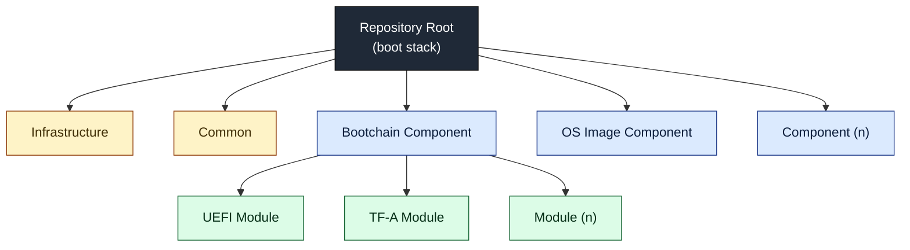

# ODP Platform — Radxa Orion O6

This repository contains all of the firmware and software resources including the operating system needed to boot a Radxa Orion O6 platform.  It serves as a demonstration of ODP features and is based on the [Orion O6 Documentation](https://radxa.com/products/orion/o6/#documentation) and [CIX P1 BIOS](https://github.com/cixtech/bios) with ODP-specific changes.

## Folder Structure and Content

The **Boot Stack** is assembled from one or more top-level **component** directories, each of which builds an independent deliverable.  A component may in turn be composed of **child modules**, where each module produces a discrete build artifact that the component then assembles into its final output.  Alongside the components, folders whose names begin with `.` provide **infrastructure** support (environment, workflows, editor settings, etc.), and a **common** directory holds shared tools, documentation, and source files that any component or module may reach into.

| Directory | Purpose |
| --- | --- |
| .* | Infrastructure and tooling for the development environment, workflows, editor settings, etc.  These folders contain no code that is part of the final Boot Stack. |
| common | Common tools, documentation, and code files provided by ODP that any component or child module may reach into. |
| bootchain | Component that produces the SPI-NOR flash binary bootchain image. |
| os_image | Component that produces the Windows OS image written to the NVMe drive. |

The folder layout differs significantly from the original CIX P1 BIOS repository and from historically typical UEFI repositories.  The intent is to highlight how the platform pieces fit together, rather than using a firmware build to demonstrate a platform build.  It also makes heavy use of Git submodules to show exactly what is needed to support this platform and ODP features.  It does, however, retain the same firmware boot sequence as the original Radxa/CIX release: **TF-A (BL31) → OP-TEE → UEFI → OS**.

Most documentation in this repository will be provided within the code files themselves, but **README.md** files are provided with detailed build instructions and design notes targeted toward the specific directory they reside in.

## Quick Start

The build output for each tagged version is published as a [GitHub Release](https://github.com/OpenDevicePartnership/odp-platform-radxa-orion-o6/releases) that can be used to boot and evaluate the platform without building locally. Each release bundles build artifacts into a single zip archive named `odp-orion-o6-vYYYY.MM.DD.zip` (where `vYYYY.MM.DD` is the release tag) that includes both debug and release variants when applicable.

The zip archive will contain an OS `.wim` file which is the Windows image to be used on the NVMe drive.  Please refer to the OS image [README](./os_image/README.md) document for how to format and write the image to the NVMe drive.  When using the archived file, the *Creating an Installation WIM Image* step in that README can be skipped.

The zip archive also contains `.bin` bootchain files (debug and release variants) that contain all firmware necessary to boot the system.  Pick either the release variant (silent boot) or the debug variant (boot messages on the serial console), then follow the [SPI-NOR Flashing](./bootchain/README.md#spi-nor-flashing) notes, which point to Radxa's offline-programmer workflow for the actual remove/program/reinstall steps.  If you flashed the debug variant, see [Serial Debug Logs](./bootchain/README.md#serial-debug-logs) for how to view the boot output.

Once both images are written, the system can be powered on and should result in booting into the Windows desktop.

Note that the OS image produced by this repository is Windows-only.  The bootchain itself is OS-agnostic, so if you want to run a different OS on the Orion O6 with this firmware, write the bootchain to SPI-NOR as described above and then follow Radxa's [Install System](https://docs.radxa.com/en/orion/o6/getting-started/install-system/udisk-system) documentation for the Linux install flow.

## Building

Each **component** in this repository must be built individually using the steps in its own README.  There is no top-level build because the components target different toolchains, operating systems, and build hosts.  For the exact build steps, refer to the README in the corresponding component directory: [bootchain/README.md](./bootchain/README.md) and [os_image/README.md](./os_image/README.md).

Components are intentionally loosely coupled, but a given component may depend on specific support, fixes, or interface revisions provided by another.  To avoid hard-to-diagnose mismatches, it is safest to build **all** components from the same Git commit and update the target system with that matching set rather than mixing artifacts produced from different revisions.

## Trademarks

This project may contain trademarks or logos for projects, products, or services. Authorized use of Microsoft
trademarks or logos is subject to and must follow [Microsoft's Trademark & Brand Guidelines](https://www.microsoft.com/en-us/legal/intellectualproperty/trademarks/usage/general).
Use of Microsoft trademarks or logos in modified versions of this project must not cause confusion or imply
Microsoft sponsorship. Any use of third-party trademarks or logos are subject to those third-party's policies.
