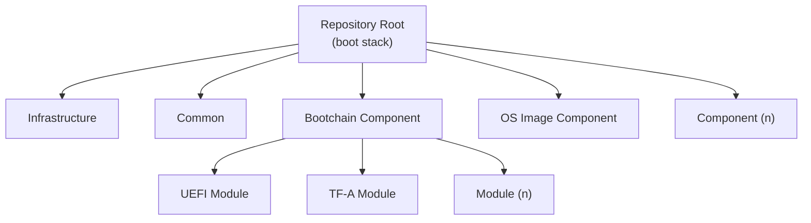

# ODP Platform — Radxa Orion O6

This repository contains all of the firmware and software resources including the operating system needed to boot a Radxa Orion O6 platform.  It serves as a demonstration of ODP features and is based on the [Orion O6 Documentation](https://radxa.com/products/orion/o6/#documentation) and [CIX P1 BIOS](https://github.com/cixtech/bios) with ODP-specific changes.

## Folder Structure and Content

The **Boot Stack** is assembled from one or more top-level **component** directories, each of which builds an independent deliverable.  A component may in turn be composed of **child modules**, where each module produces a discrete build artifact that the component then assembles into its final output.  Alongside the components, folders whose names begin with `.` provide **infrastructure** support (environment, workflows, editor settings, etc.), and a **common** directory holds shared tools, documentation, and source files that any component or module may reach into.

| Directory | Purpose |
| --- | --- |
| .* | Infrastructure and tooling for the development environment, workflows, editor settings, etc.  These folders contain no code that is part of the final Boot Stack. |
| common | Common tools, documentation, and code files provided by ODP that any component or child module may reach into. |
| bootchain | Component that produces the SPI-NOR flash binary bootchain image. |
| os_image | Component that produces the Windows OS image written to the NVMe drive. |

The folder layout differs significantly from the original CIX P1 BIOS repository and from historically typical UEFI repositories.  The intent is to highlight how the platform pieces fit together, rather than using a firmware build to demonstrate a platform build.  It also makes heavy use of Git submodules to show exactly what is needed to support this platform and ODP features.  It does, however, retain the same firmware boot sequence as the original Radxa/CIX release: **TF-A (BL31) → OP-TEE → UEFI → OS**.

Most documentation in this repository will be provided within the code files themselves, but **README.md** files are provided with detailed build instructions and design notes targeted toward the specific directory they reside in.

## Quick Start

TBD - Will be part of next PR for the GitHub workflows

## Trademarks

This project may contain trademarks or logos for projects, products, or services. Authorized use of Microsoft
trademarks or logos is subject to and must follow [Microsoft's Trademark & Brand Guidelines](https://www.microsoft.com/en-us/legal/intellectualproperty/trademarks/usage/general).
Use of Microsoft trademarks or logos in modified versions of this project must not cause confusion or imply
Microsoft sponsorship. Any use of third-party trademarks or logos are subject to those third-party's policies.
